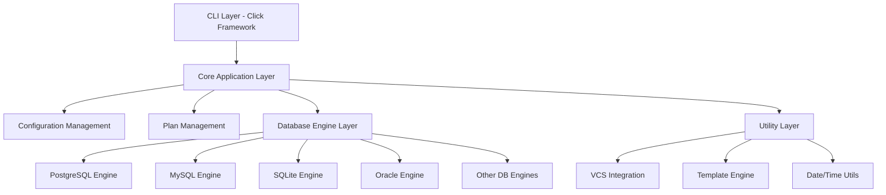

# Design Document

## Overview

The Sqlitch Python Port is a complete reimplementation of the Perl-based sqitch database change management tool in Python, renamed to "sqlitch" to avoid confusion with the original. The design maintains strict CLI compatibility while leveraging modern Python patterns including type hints, dataclasses, and async capabilities where beneficial. The architecture follows a modular design with clear separation between CLI, core logic, database engines, and utilities.

## Architecture

### High-Level Architecture



### Package Structure

```
sqlitch_py/
├── __init__.py              # Package initialization and version
├── cli.py                   # Main CLI entry point using Click
├── core/                    # Core application logic
│   ├── __init__.py
│   ├── sqitch.py           # Main Sqitch application class
│   ├── config.py           # Configuration management
│   ├── plan.py             # Plan file parsing and management
│   ├── change.py           # Change representation
│   ├── target.py           # Database target configuration
│   ├── exceptions.py       # Custom exception hierarchy
│   └── types.py            # Type definitions and validators
├── engines/                 # Database engine implementations
│   ├── __init__.py
│   ├── base.py             # Abstract base engine
│   ├── pg.py               # PostgreSQL implementation
│   ├── mysql.py            # MySQL/MariaDB implementation
│   ├── sqlite.py           # SQLite implementation
│   ├── oracle.py           # Oracle implementation
│   ├── snowflake.py        # Snowflake implementation
│   ├── vertica.py          # Vertica implementation
│   ├── exasol.py           # Exasol implementation
│   └── firebird.py         # Firebird implementation
├── commands/                # CLI command implementations
│   ├── __init__.py
│   ├── base.py             # Base command class
│   ├── init.py             # Project initialization
│   ├── add.py              # Add changes
│   ├── deploy.py           # Deploy changes
│   ├── revert.py           # Revert changes
│   ├── verify.py           # Verify changes
│   ├── status.py           # Show status
│   ├── log.py              # Show change log
│   ├── tag.py              # Tag releases
│   ├── bundle.py           # Bundle projects
│   ├── checkout.py         # Checkout database state
│   ├── rebase.py           # Rebase plans
│   └── show.py             # Show change details
└── utils/                   # Utility modules
    ├── __init__.py
    ├── git.py              # Git integration
    ├── template.py         # Template processing
    ├── datetime.py         # Date/time utilities
    ├── terminal.py         # Terminal output formatting
    └── io.py               # File I/O utilities
```

## Components and Interfaces

### Core Application Layer

#### Sqitch Class (`sqlitch_py/core/sqitch.py`)

The main application class that coordinates all operations:

```python
@dataclass
class Sqitch:
    """Main Sqitch application class."""
    
    config: Config
    options: Dict[str, Any] = field(default_factory=dict)
    verbosity: int = field(init=False)
    user_name: Optional[str] = field(init=False)
    user_email: Optional[str] = field(init=False)
    
    def __post_init__(self) -> None:
        """Initialize computed fields."""
        self.verbosity = self._compute_verbosity()
        self.user_name = self._get_user_name()
        self.user_email = self._get_user_email()
    
    def engine_for_target(self, target: Target) -> Engine:
        """Create appropriate engine for target."""
        
    def run_command(self, command_name: str, args: List[str]) -> int:
        """Execute a sqitch command."""
```

#### Configuration Management (`sqlitch_py/core/config.py`)

Handles sqitch.conf file parsing and configuration hierarchy:

```python
class Config:
    """Configuration management for sqitch."""
    
    def __init__(self, config_files: Optional[List[Path]] = None):
        self._config = configparser.ConfigParser()
        self._load_configs(config_files or self._default_config_files())
    
    def get(self, key: str, default: Any = None) -> Any:
        """Get configuration value with dot notation."""
        
    def set(self, key: str, value: Any) -> None:
        """Set configuration value."""
        
    def get_target(self, name: str) -> Target:
        """Get target configuration."""
```

#### Plan Management (`sqlitch_py/core/plan.py`)

Parses and manages sqitch.plan files:

```python
@dataclass
class Plan:
    """Represents a sqitch deployment plan."""
    
    file: Path
    project: str
    uri: Optional[str]
    changes: List[Change]
    tags: List[Tag]
    
    @classmethod
    def from_file(cls, file_path: Path) -> 'Plan':
        """Parse plan from file."""
        
    def changes_since(self, change_id: str) -> List[Change]:
        """Get changes since specified change."""
        
    def validate(self) -> List[str]:
        """Validate plan consistency."""
```

#### Change Representation (`sqlitch_py/core/change.py`)

Represents individual database changes:

```python
@dataclass
class Change:
    """Represents a single database change."""
    
    name: str
    note: Optional[str]
    tags: List[str]
    dependencies: List[Dependency]
    conflicts: List[str]
    timestamp: datetime
    planner_name: str
    planner_email: str
    
    @property
    def id(self) -> str:
        """Generate change ID (SHA1 hash)."""
        
    def deploy_file(self, target: Target) -> Path:
        """Get deploy script path."""
        
    def revert_file(self, target: Target) -> Path:
        """Get revert script path."""
        
    def verify_file(self, target: Target) -> Path:
        """Get verify script path."""
```

### Database Engine Layer

#### Base Engine (`sqlitch_py/engines/base.py`)

Abstract base class for all database engines:

```python
from abc import ABC, abstractmethod

class Engine(ABC):
    """Abstract base class for database engines."""
    
    def __init__(self, sqitch: Sqitch, target: Target):
        self.sqitch = sqitch
        self.target = target
        self._connection: Optional[Any] = None
    
    @abstractmethod
    def initialize_registry(self) -> None:
        """Create sqitch metadata tables."""
        
    @abstractmethod
    def deploy_change(self, change: Change) -> None:
        """Deploy a single change."""
        
    @abstractmethod
    def revert_change(self, change: Change) -> None:
        """Revert a single change."""
        
    @abstractmethod
    def verify_change(self, change: Change) -> bool:
        """Verify a change is properly deployed."""
        
    @abstractmethod
    def current_state(self) -> Optional[Change]:
        """Get current deployed state."""
        
    @abstractmethod
    def deployed_changes(self) -> List[Change]:
        """Get list of deployed changes."""
        
    def connect(self) -> Any:
        """Establish database connection."""
        
    def disconnect(self) -> None:
        """Close database connection."""
```

#### PostgreSQL Engine (`sqlitch_py/engines/pg.py`)

PostgreSQL-specific implementation:

```python
class PostgreSQLEngine(Engine):
    """PostgreSQL database engine."""
    
    def __init__(self, sqitch: Sqitch, target: Target):
        super().__init__(sqitch, target)
        self._registry_schema = target.registry or 'sqitch'
    
    def connect(self) -> psycopg2.connection:
        """Connect to PostgreSQL database."""
        
    def initialize_registry(self) -> None:
        """Create PostgreSQL sqitch metadata tables."""
        
    def deploy_change(self, change: Change) -> None:
        """Deploy change to PostgreSQL."""
        
    def _execute_sql_file(self, file_path: Path) -> None:
        """Execute SQL file with proper error handling."""
        
    def _log_change(self, change: Change, operation: str) -> None:
        """Log change to sqitch.changes table."""
```

### CLI Layer

#### Main CLI (`sqlitch_py/cli.py`)

Click-based command-line interface:

```python
import click
from typing import Optional

@click.group()
@click.option('--config', '-c', multiple=True, help='Configuration file')
@click.option('--verbose', '-v', count=True, help='Increase verbosity')
@click.option('--quiet', '-q', count=True, help='Decrease verbosity')
@click.pass_context
def cli(ctx: click.Context, config: tuple, verbose: int, quiet: int) -> None:
    """Sqlitch database change management."""
    ctx.ensure_object(dict)
    ctx.obj['verbosity'] = verbose - quiet
    ctx.obj['config_files'] = list(config) if config else None

@cli.command()
@click.argument('engine', required=False)
@click.option('--top-dir', help='Top directory for project')
@click.pass_context
def init(ctx: click.Context, engine: Optional[str], top_dir: Optional[str]) -> None:
    """Initialize a sqlitch project."""
    from sqlitch_py.commands.init import InitCommand
    cmd = InitCommand(ctx.obj)
    return cmd.execute(engine=engine, top_dir=top_dir)
```

#### Base Command (`sqlitch_py/commands/base.py`)

Base class for all commands:

```python
class BaseCommand:
    """Base class for sqlitch commands."""
    
    def __init__(self, options: Dict[str, Any]):
        self.options = options
        self.sqitch = self._create_sqitch()
    
    def _create_sqitch(self) -> Sqitch:
        """Create Sqitch instance with configuration."""
        config_files = self.options.get('config_files')
        config = Config(config_files)
        return Sqitch(config=config, options=self.options)
    
    def execute(self, **kwargs) -> int:
        """Execute the command. Override in subclasses."""
        raise NotImplementedError
```

## Data Models

### Configuration Schema

The configuration system supports the same INI-style format as Perl sqitch:

```ini
[core]
    engine = pg
    top_dir = .
    plan_file = sqitch.plan

[engine "pg"]
    target = db:pg://user@localhost/mydb
    registry = sqitch
    client = psql

[target "production"]
    uri = db:pg://user@prod.example.com/mydb

[user]
    name = John Doe
    email = john@example.com
```

### Plan File Format

Plan files maintain exact compatibility with Perl sqitch:

```
%syntax-version=1.0.0
%project=myproject
%uri=https://github.com/example/myproject

initial_schema 2023-01-15T10:30:00Z John Doe <john@example.com> # Initial schema
users [initial_schema] 2023-01-16T14:20:00Z John Doe <john@example.com> # Add users table
@v1.0 2023-01-20T09:00:00Z John Doe <john@example.com> # Release v1.0

posts [users] 2023-01-25T11:15:00Z Jane Smith <jane@example.com> # Add posts table
```

### Database Schema

Each engine maintains metadata tables with identical schemas to Perl sqitch:

#### sqitch.changes
- change_id (TEXT PRIMARY KEY)
- change (TEXT NOT NULL)
- project (TEXT NOT NULL)
- note (TEXT NOT NULL DEFAULT '')
- committed_at (TIMESTAMP WITH TIME ZONE NOT NULL DEFAULT NOW())
- committer_name (TEXT NOT NULL)
- committer_email (TEXT NOT NULL)
- planned_at (TIMESTAMP WITH TIME ZONE NOT NULL)
- planner_name (TEXT NOT NULL)
- planner_email (TEXT NOT NULL)

#### sqitch.dependencies
- change_id (TEXT NOT NULL REFERENCES sqitch.changes(change_id))
- type (TEXT NOT NULL)
- dependency (TEXT NOT NULL)
- dependency_id (TEXT)

#### sqitch.tags
- tag_id (TEXT PRIMARY KEY)
- tag (TEXT NOT NULL UNIQUE)
- project (TEXT NOT NULL)
- change_id (TEXT NOT NULL REFERENCES sqitch.changes(change_id))
- note (TEXT NOT NULL DEFAULT '')
- committed_at (TIMESTAMP WITH TIME ZONE NOT NULL DEFAULT NOW())
- committer_name (TEXT NOT NULL)
- committer_email (TEXT NOT NULL)
- planned_at (TIMESTAMP WITH TIME ZONE NOT NULL)
- planner_name (TEXT NOT NULL)
- planner_email (TEXT NOT NULL)

## Error Handling

### Exception Hierarchy

```python
class SqlitchError(Exception):
    """Base exception for all sqitch errors."""
    pass

class ConfigurationError(SqlitchError):
    """Configuration-related errors."""
    pass

class PlanError(SqlitchError):
    """Plan file parsing or validation errors."""
    pass

class EngineError(SqlitchError):
    """Database engine errors."""
    pass

class DeploymentError(EngineError):
    """Deployment operation errors."""
    pass

class ConnectionError(EngineError):
    """Database connection errors."""
    pass
```

### Error Message Compatibility

All error messages maintain compatibility with Perl sqitch for consistent user experience:

```python
def format_error_message(error_type: str, details: str) -> str:
    """Format error messages to match Perl sqitch output."""
    return f"sqitch: {error_type}: {details}"
```

## Testing Strategy

### Test Structure

```
tests/
├── unit/                    # Unit tests
│   ├── test_config.py
│   ├── test_plan.py
│   ├── test_engines/
│   │   ├── test_base.py
│   │   ├── test_pg.py
│   │   └── test_mysql.py
│   └── test_commands/
│       ├── test_init.py
│       ├── test_deploy.py
│       └── test_revert.py
├── integration/             # Integration tests
│   ├── test_cli.py
│   ├── test_full_workflow.py
│   └── test_database_engines.py
└── compatibility/           # Perl compatibility tests
    ├── test_cli_compatibility.py
    ├── test_output_format.py
    └── test_database_state.py
```

### Test Database Setup

Integration tests use Docker containers for isolated database testing:

```python
@pytest.fixture(scope="session")
def postgres_container():
    """Provide PostgreSQL container for testing."""
    with DockerContainer("postgres:13") as container:
        container.with_env("POSTGRES_PASSWORD", "test")
        container.with_exposed_ports(5432)
        container.start()
        yield container
```

### Compatibility Testing

Automated tests compare Python sqitch output with Perl sqitch:

```python
def test_deploy_output_compatibility(temp_project, postgres_db):
    """Verify deploy command output matches Perl sqitch."""
    perl_output = run_perl_sqitch(["deploy"], cwd=temp_project)
    python_output = run_python_sqitch(["deploy"], cwd=temp_project)
    
    assert normalize_output(perl_output) == normalize_output(python_output)
```

## Performance Considerations

### Connection Management

- Connection pooling for multiple operations
- Lazy connection establishment
- Proper connection cleanup with context managers

### Plan File Parsing

- Lazy loading of plan files
- Caching of parsed plans
- Incremental parsing for large plans

### SQL Execution

- Batch operations where possible
- Prepared statements for repeated queries
- Transaction management for atomic operations

### Memory Usage

- Streaming for large SQL files
- Generator-based iteration over changes
- Minimal object creation in hot paths

## Internationalization

### Message Localization

Support for the same locales as Perl sqitch:

```python
import gettext

def setup_i18n(locale_dir: Path, domain: str = "sqitch") -> None:
    """Setup internationalization."""
    gettext.bindtextdomain(domain, locale_dir)
    gettext.textdomain(domain)

def _(message: str) -> str:
    """Translate message."""
    return gettext.gettext(message)
```

### Locale-Specific Formatting

- Date/time formatting per locale
- Number formatting
- Currency formatting where applicable

## Security Considerations

### Database Connections

- Secure credential handling
- SSL/TLS support for all engines
- Connection string sanitization in logs

### SQL Injection Prevention

- Parameterized queries for all user input
- Input validation and sanitization
- Proper escaping of identifiers

### File System Security

- Path traversal prevention
- Secure temporary file handling
- Proper file permissions

## Migration Path

### Compatibility Layer

Provide utilities to help users migrate from Perl to Python sqitch:

```python
def verify_compatibility(project_dir: Path) -> List[str]:
    """Verify project compatibility with Python sqitch."""
    issues = []
    
    # Check plan file format
    # Check configuration files
    # Check SQL script compatibility
    
    return issues
```

### Gradual Migration

Support running both versions side-by-side during transition:

- Shared metadata tables
- Compatible lock mechanisms
- Identical change ID generation